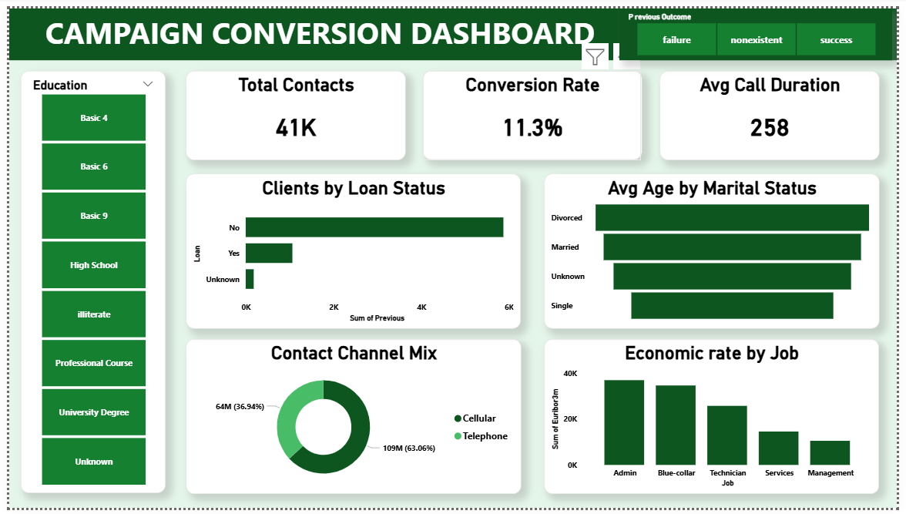

# 📈 Marketing Campaign Conversion Dashboard

## 1. Executive Summary
This Power BI dashboard evaluates direct marketing campaign performance, outreach effectiveness, and customer conversion dynamics across **41,000 total contacts**. Developed using **Power Query** for data transformation and **DAX** for key metrics, it highlights demographic variations (education, marital status, job roles) and channel performance to optimize marketing ROI.

---

## 2. Key Performance Indicators (KPIs)
* **Total Contacts:** `41K`
* **Overall Conversion Rate:** `11.3%`
* **Average Call Duration:** `258 seconds`

---

## 3. Key Analytical Insights
1. **Contact Channel Mix:**
   * **Cellular** is the dominant communication channel, accounting for **63.06%** (109M) of outreach, compared to **Telephone** at **36.94%** (64M).
2. **Loan Status Distribution:**
   * The vast majority of contacted clients have **no active personal loan** (~6K), while a smaller segment holds existing loans (~1K).
3. **Economic Rate by Job Category:**
   * **Admin** and **Blue-collar** workers represent the highest volume across economic rate metrics (Euribor 3-month rate), followed by **Technicians**, **Services**, and **Management**.
4. **Demographic Slicing:**
   * Average age varies across marital statuses (Divorced, Married, Unknown, Single), providing clear audience segmentation for targeted campaigns.

---

## 4. Technical Workflow (Power Query & DAX)
* **Data Transformation (Power Query):** Cleaned raw bank marketing data, standardized education tiers (Basic 4/6/9, High School, University Degree, etc.), and grouped previous campaign outcomes.
* **DAX Calculations:** Created custom measures for conversion percentage, call duration averages, and aggregated outreach channels.
* **UI/UX Design:** Built a forest green themed layout with a vertical **Education** filter slicer, top-level **Previous Outcome** filter buttons (`failure`, `nonexistent`, `success`), and card KPIs.

---

## 5. Strategic Recommendations
* **Prioritize Cellular Outreach:** Focus marketing resources on cellular contacts, as mobile channels represent the bulk of engagement.
* **Target High-Performing Job Roles:** Tailor financial product offerings specifically toward Admin and Blue-collar segments showing high engagement levels.
* **Optimize Call Duration:** Focus agent training on capitalizing within the initial 4-to-5-minute window (258s average) to boost the 11.3% conversion baseline.
